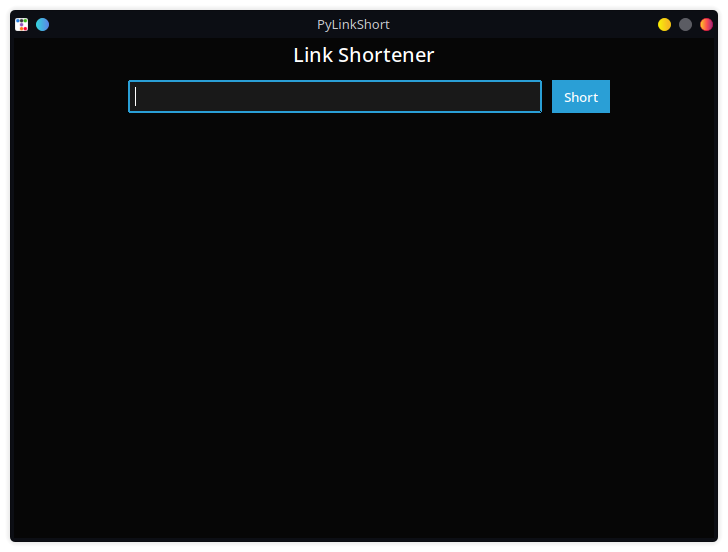
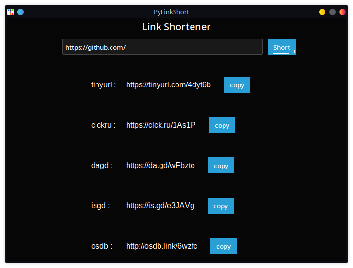

# PyLinkShort

PyLinkShort is a GUI application that allows users to generate short links for a given URL using various URL shortening services. The user can choose from popular URL shortening services like TinyURL, clckru, dagd, isgd, and osdb to create short links.


## Features

- Generate short links for a given URL using various URL shortening services.
- Support for popular URL shortening services like TinyURL, clckru, dagd, isgd, and osdb.
- Copy the generated short link to the clipboard with just one click.
- An intuitive and user-friendly interface for easy interaction.

## Dependencies

The application is built using Python and relies on the following libraries:

- tkinter- The standard Python interface to the Tk GUI toolkit.
- pyperclip- A cross-platform clipboard module for Python, used to copy the shortened links to the clipboard.
- pyshorteners - A library to shorten URLs using various shortening services.
- ttkbootstrap - A themeable widget set built on top of ttk (Tile extension) for Tkinter, providing a visually appealing GUI.
- ttkbootstrap.dialogs.dialogs - Additional dialog widgets for ttkbootstrap.

## Installation

1. First, make sure you have Python installed.

2. Install the required dependencies using `pip`:

```bash
pip install tkinter pyperclip pyshorteners ttkbootstrap
```

## Usage

1. Clone the repository:

```bash
git clone https://github.com/arpanduari/PyLinkShort.git
cd PyLinkShort
```

2. Run the Python script:

```bash
python main.py
```

3. The GUI application will open, and you can enter the URL you want to shorten.

4. Click the "Short" button to generate the shortened link.
  
5. Choose one of the available URL shortening services.

6. If you want to copy the specific shortened link to the clipboard, click the "Copy" button next to that link.



## Author
- [arpanduari](https://github.com/arpanduari)
